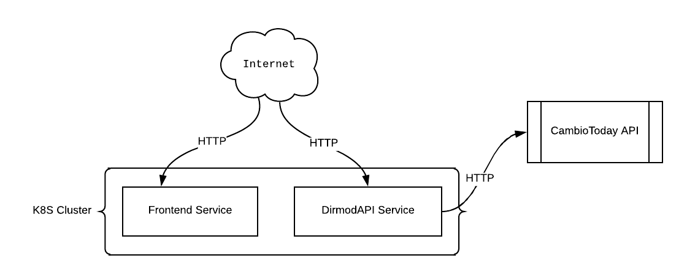
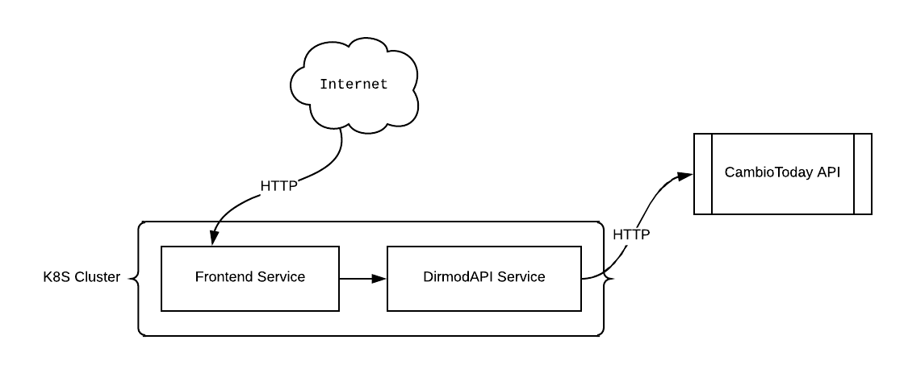
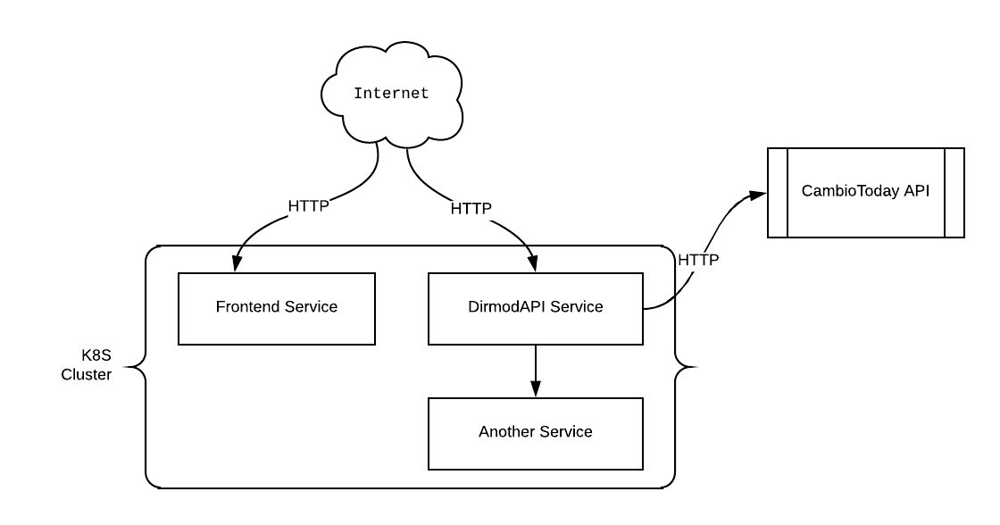

# DirmodApp: ARS Quotations Monitoring App. 
 

This is an application that I started building as a POC project for a consulting company that I applied. 
Basically what it does is that it tracks the daily quotations from ARS to USD, EUR and BRL periodically.
And nope, I didn't hear back from them. *But* I decided to add a little bit of spiciness into the project
and take this as an opportunity to learn Kubernetes because I've been always wanting to learn it.

> :bulb: **Note: Please keep in mind that developing a project like this adding the complexity that Kubernetes brings into is absolutely nonsense.**
> As I said previously, I only used it for learning purposes.

## Services Arquitecture

| Service                                              | Language                                              | Description                                                                                  |
| ---------------------------------------------------- | ----------------------------------------------------- | -------------------------------------------------------------------------------------------- |
| [Frontend Service](./client/web)                     | JavaScript/[React.js](https://reactjs.org/)           | Exposes a static server serving a production-ready React application with a super basic UI.  |
| [DirmodAPI Service](./api-server)                    | C#/[.NET Core](https://dotnet.microsoft.com/download) | Acts as a proxy that requests the data from the [CambioToday API](https://cambio.today/api). |

**A little bit of context:**

I want you to take at look at how the application is structured:

As you can see the users call both services directly, **they don't talk to each other**. But why is that?

The reason for that is because the frontend service serves a static website as a single page and a bunch of js scripts - the resulting bundle of [Webpack](https://webpack.js.org/), 
meaning that the frontend runs entirely in the browser (i.e. everything is rendered client-side).

That said, it means that the browser is the one sending the requests. *And* since the browser is by any means not inside of the Kubernetes cluster,
it needs to call the service with its external IP.

If the frontend was server-side rendered - as [Next.js](https://nextjs.org/) does - or any other framework, we could talk to the DirmodAPI with this model:

**However**, if we were to incorporate another service into our current model, DirmodAPI could talk to that service as shown below:

Now that makes more sense, right? :wink:

## Installation

Check out the [installation](./docs/INSTALLATION.md) guide to find out the different ways to set up this project.
